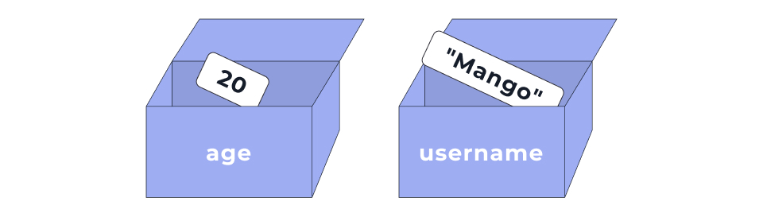

# Змінні та типи. Основи функцій

###### [to main page](../js_main.md)

**Синтаксис у програмуванні** визначає набір конструкцій, за якими створюється
програма. Наприклад, яка правильна послідовність використання ключових слів та
символів, де необхідна ;, а де :, різниця між одинарними ‘’, парними “” або
косими ```` лапками тощо. Синтаксис дуже важливий. Якщо в коді є навіть
найдрібніша помилка, програма не виконається.

Програмування використовується в багатьох сферах: для розробки вебсайтів і
додатків, створення комп'ютерних ігор, наукових досліджень, аналізу даних,
автоматизації бізнес-процесів та багато іншого. Програмування є способом
написання коду.

**Код** — це набір інструкцій, які комп'ютер може зрозуміти й виконати. Мови
програмування надають різні синтаксичні та семантичні правила для написання цих
інструкцій. Інструкція, що спрацює у Python, може не працювати у JavaScript.

**Вихідний код** (source code) — це текст комп'ютерної програми будь-якою мовою
програмування. Він містить набір синтаксичних конструкцій, що описують набір
інструкцій для комп'ютера.

Сам собою вихідний код незрозумілий для машини. Є крок, що виконується після
написання програми, який конвертує вихідний код у набір інструкцій, зрозумілих
комп'ютеру. Цим займається спеціальна програма: **компілятор** або
**інтерпретатор**. Вихідний код повинен не тільки правильно розв’язувати задачу,
а й бути зрозумілим розробнику, який створив цей код, або тому, хто вносить
зміни до нього.

Важливими аспектами програмування є логіка та розв’язання проблем. Досвідчені
розробники розглядають проблеми з точки зору алгоритмів.

**Алгоритм** — це набір кроків, які потрібно виконати задля досягнення певної
мети. Ми постійно використовуємо алгоритми в повсякденному житті. Наприклад,
процес приготування чаю — це набір необхідних кроків: закип'ятити воду —>
відміряти чай —> покласти чай у прогрітий посуд —> залити водою —> зачекати 5
хвилин. Це приклад алгоритму.

У процесі розв'язання проблеми також необхідно дотримуватися алгоритму. У
найбільш загальному вигляді алгоритм створення програми виглядає так:

-   розбити завдання на більш дрібні підзавдання;
-   визначити послідовність виконання підзавдань;
-   використовувати відповідні інструменти для розв’язання завдання.

---

## Мова JavaScript

**JavaScript** — високорівнева мова програмування, що підтримується всіма
сучасними веббраузерами.

> ! JavaScript не має жодного стосунку до мови Java. Це дві незалежні мови
> програмування.

У Front-end розробці JavaScript використовується у зв'язці з HTML та CSS для
забезпечення функціональності вебсторінки, такої як:

-   нескладні обчислення;
-   перевірка та маніпуляція даними, які було введено користувачем;
-   зберігання інформації у браузері користувача;
-   динамічна зміна HTML-документа;
-   реакція на дії користувача;
-   створення інтерактивних елементів: галерей, графіків тощо;
-   взаємодія з бекендом.

> ! Якщо JavaScript-код пишеться для виконання в браузері (Front-end), розробник
> не має інструментів і доступу до файлової або операційної системи з міркувань
> безпеки.

Також на сьогоднішній день, використовуючи JavaScript, можна створювати:

-   вебдодатки на фреймворках React, Vue, Angular тощо;
-   бекенд програми на Node.js;
-   мобільні додатки на React Native;
-   десктоп програми за допомогою Electron.

## Інструкція

При написанні коду важливо не тільки знати, які символи чи конструкції можна
використовувати, але в першу чергу розуміти термінологію та складові вихідного
коду.

У цій секції ми ознайомимося з базовою термінологією та синтаксисом.

**Інструкція** (statement) — це пов'язаний набір слів і символів із синтаксису
мови, які об'єднуються, щоб висловити одну ідею, тобто одну інструкцію для
машини. Розгляньмо приклад інструкції нижче.

```js
a = b * 2;
```

У JavaScript інструкції закінчуються ; крапкою з комою, яку можна порівняти з
крапкою в кінці речення твоєю рідною мовою.

-   a і b — змінні (як у рівнянні алгебри). Змінні — це сховища даних, які
    використовує програма. Вони складаються з ідентифікатора (імені) та
    пов'язаного з ним значення. Детальніше розберемо, що таке змінні, трохи
    пізніше.
-   2 — просто число. Це називається **значенням літералу** (literal value),
    оскільки воно не зберігається у змінній.
-   = і \* — оператори, що виконують дії над значеннями та змінними.

#### Як працюватиме ця інструкція?

Уявимо, що змінна b зберігає будь-яке число, наприклад 10. Тоді ця інструкція
каже машині таке:

1. Піди знайди змінну з ідентифікатором b і дізнайся, яке в неї зараз значення.
2. Підстав значення змінної b (наприклад 10) в інструкцію замість b.
3. Виконай операцію множення 10 на 2.
4. Запиши результат обчислення виразу з правого боку у змінну a.

Отже, значення змінної **a** дорівнюватиме **20**. Ця інструкція виконується
послідовно і є основою виконання дій у програмі.

## Вираз та літерал

У людських мовах є речення, що виражають закінчену думку. Речення складаються із
фраз. Аналогічно, у мовах програмування є інструкції, що дають команду
комп’ютеру. Інструкції складаються з менших частин — виразів.

**Вираз** (expression) — це посилання на змінну чи значення, або на набір
змінних і значень у поєднанні з операторами.


У цьому прикладі інструкція містить 5 виразів. Кожна інструкція виділена
квадратними дужками для візуалізації (це не синтаксис мови):

-   2 — вираз значення літерала. Тут використовується числовий літерал, що
    представляє число 2
-   b та a — вирази змінних. Вони вказують на необхідність використовувати
    значення змінних b та a відповідно. Однак значення цих змінних будуть
    використані лише у випадку, якщо змінні стоять у правій частині виразу
    присвоювання
-   b \* 2 — арифметичний вираз множення. Тут значення змінної b множиться на
    число 2
-   a = b \* 2 — вираз присвоювання. У даному випадку він вказує на необхідність
    обчислення правої частини виразу й присвоювання результату змінній a, що
    знаходиться в лівій частині виразу

Існують інші типи виразів: вирази виклику функцій, вирази порівняння тощо. Ми
розглянемо їх пізніше. Наразі важливо розуміти, з яких частин складається
вихідний код і як правильно його читати.

**Літерал** — це значення, яке вказується безпосередньо в коді програми та
представляє певний тип даних.

-   Числовий літерал — це число, записане в коді програми.
-   Рядковий літерал — це послідовність символів, укладених у лапки.

Літерали використовуються, щоб задати початкові значення змінних та інших
операцій, де потрібно конкретне значення.

```js
// Числовий літерал
10;

// Рядковий літерал
('JavaScript is awesome!');
```

---

## Підключення скрипта

Для підключення скрипта JavaScript до HTML-сторінки можна використати тег
`<script>` Існує кілька способів, як це можна зробити:

#### Вбудований скрипт

Можна додати JavaScript-код прямо всередині тега `<script>` всередині тега
`<head>`:

```html
<!DOCTYPE html>
<html>
    <head>
        <title>My HTML-page</title>
        <script>
            <!--Твій JavaScript-код тут-->
            console.log('Hello, world');
        </script>
    </head>
    <body>
        <!-- Вміст сторінки -->
    </body>
</html>
```

#### Зовнішній скрипт

По-перше, треба створити окремий файл із розширенням `.js`, що містить
JavaScript-код. Потім під'єднати цей файл до HTML-сторінки за допомогою тега
`<script>`, вказавши шлях до файлу в атрибуті `src`:

Тег `<script>` з атрибутом defer можна вставити як у `<head>`, так і в `<body>`
— немає жодної різниці.

У цьому прикладі файл `my-script.js` містить JavaScript-код, який буде виконано
на сторінці. Атрибут `defer` вказує браузеру, що скрипт повинен бути виконаний
після того, як HTML-документ буде повністю завантажений. Це дозволяє уникнути
затримки відображення вмісту сторінки.

У багатьох випадках краще використовувати зовнішні скрипти, щоб зробити код
більш читабельним, зручним для підтримки та перевикористання.

> ! **Зверни увагу!**, що під час написання коду в редакторі VSCode і
> встановленому в ньому розширенні Live Server, вебсторінка буде
> перезавантажуватися щоразу, коли зберігаються нові зміни у файлі скрипта.

## Суворий режим

`Суворий режим` (англ. strict mode) у JavaScript — це спеціальний режим
виконання коду, який дає змогу переводити скрипт у режим повної відповідності
сучасному стандарту. Це запобігає певним помилкам, наприклад, використанню
небезпечних і застарілих конструкцій, що робить код надійнішим та дозволяє легше
його підтримувати.

Щоб увімкнути суворий режим, потрібно додати директиву `'use strict'`; на
початок скрипта. Наприклад:

```js
'use strict';

// Код у суворому режимі
```

> ! Рекомендується завжди використовувати суворий режим у своїх проєктах, щоб
> уникнути непередбачуваних ситуацій і проблем у коді.

## Виведення даних

Розробнику потрібно перевіряти правильність роботи програми в певний момент часу
та виводити інформацію в певному місці коду. Для цього є консоль в інструментах
розробника браузера на вкладці `Console`.


Наступні комбінації клавіш відкривають інструменти розробника на вкладці
`Console`:

-   Windows і Linux — `Ctrl` + `Shift` + `J`;
-   MacOS — `Command` + `Option` + `J` .

#### Метод console.log()

Щоб вивести дані в консоль розробника використовується метод `console.log()`.

```js
console.log(value);
```

Значення `value`, яке вказано в круглих дужках, буде виведено в консоль
розробника при виконанні програми.

При виконанні цього коду в консоль розробника будуть послідовно виведені рядок і
число.


> ! **Увага!** Обов'язково використовуй крапку з комою ; у кінці рядка в
> автоперевірках. В іншому разі, автоперевірка може не зчитати введений код.

---

## Змінні та типи даних

### Оголошення змінних

Змінна — це контейнер, який використовується для зберігання даних. Змінна
складається з:

-   ідентифікатора (унікального імені);
-   області пам’яті, де зберігається її значення.

Змінну можна уявити, як коробку з написом (іменем), у якій щось лежить
(значення).



Розглянемо приклади оголошення змінних.

```js
const age = 20;
const username = 'Mango';
```

-   Оголошення змінної починається з ключового слова (у прикладі: `const`). У
    сучасному синтаксисі JavaScript змінні краще оголошувати за допомогою
    ключових слів `const` і `let`. Створення змінної без ключового слова може
    призвести до помилки.
-   Після ключового слова, через пробіл, вказується ім'я змінної (у прикладі:
    `age` та `username`).
-   Щоб присвоїти змінній значення, використовують оператор присвоєння `=`
-   Інструкція оголошення змінної закінчується крапкою з комою `;` .
-   Для кращої читабельності кожне нове оголошення змінної рекомендується
    розпочинати з нового рядка.

Після оголошення змінної до неї можна звернутися за допомогою її імені далі у
коді. Це необхідно для виконання операцій зі значенням змінної. Наприклад, для
виведення її значення в консоль інструментів розробника.

```js
const age = 20;
console.log(age); // 20

const username = 'Mango';
console.log(username); // "Mango"
```

---

## Рядки

### Конкатенація рядків

Якщо застосувати оператор `+` до рядка та будь-якого іншого типу даних,
результатом буде новий рядок, що містить об'єднання вихідних значень. Це
називається конкатенація (склеювання).

```js
const message = 'Mango ' + 'is' + ' happy';
console.log(message); // "Mango is happy"
```

> ! **Зверни увагу!** Рядки "Mango " і " happy" містять пробіли, щоб текст
> повідомлення був читабельним.

Під час конкатенації можна використовувати значення змінних, щоб складати рядки
з динамічними значеннями. Для цього необхідно вказати ім'я змінної, у це місце
буде підставлено її значення.

```js
const age = 24;
const message = 'Poly is ' + age + ' years old!';
```

Під час конкатенації будь-який тип даних буде приведено до рядка та поєднано з
іншим рядком.

```js
console.log('Mango' + 55); // "Mango55"
console.log('Mango' + true); // "Mangotrue"
```

Проте порядок операндів має значення. Перетворення типів відбувається лише в
момент операції додавання з рядком. До цього моменту застосовуються нормальні
правила математики.

```js
console.log(1 + '2'); // "12"
console.log(1 + '2' + 4); // "124"
console.log(1 + 2 + '4'); // "34"
```

В останньому прикладі спочатку виконується математичне додавання для перших двох
чисел `1` і `2`, потім число `3` перетворюється на рядок `"3"` і поєднується з
рядком `"4"`.

---

## Оператори порівняння

Оператори порівняння використовуються для порівняння двох значень і повертають
булеве значення (`true` або `false`) залежно від результату порівняння.

Ось деякі основні оператори порівняння:

-   Оператор `>` (більше) — повертає `true`, якщо **лівий** операнд **більше**
    правого. В іншому разі повертає `false` .

-   Оператор `<` (менше) — повертає `true`, якщо **лівий** операнд **менше**
    правого. В іншому разі повертає `false` .

-   Оператор `>=` (більше або дорівнює) — повертає `true`, якщо **лівий**
    операнд **більше або дорівнює правому**. Якщо навпаки, повертає `false` .

-   Оператор `<=` (менше або дорівнює) — повертає `true`, якщо **лівий** операнд
    **менше або дорівнює** правому. Якщо навпаки, повертає `false` .

Давай розглянемо приклади використання цих операторів:

```js
const a = 2;
const b = 5;

console.log(a > b); // false
console.log(b > a); // true
console.log(a >= b); // false
console.log(b >= a); // true

console.log(a < b); // true
console.log(b < a); // false
console.log(a <= b); // true
console.log(b <= a); // false
```

Основний принцип використання операторів порівняння полягає в тому, щоб
порівнювати значення та отримувати булевий результат. Булевий результат
(результат у вигляді `true` або `false`) дозволяє приймати певні рішення та
контролювати поведінку програми відповідно до умов.

Оператори порівняння часто використовуються в умовних виразах або циклах, про
які дізнаєшся пізніше, для перевірки умов та виконання певних дій на основі
результатів порівняння. Наприклад, користувачі, старші за 18 років, отримують
доступ до певної групи товарів.

---

## Основи функцій

### Оголошення та виклик функції

Функція — це незалежний блок коду, який виконує певну задачу з різними
початковими значеннями.

Функцію можна представити, як чорну скриньку, яка приймає дані на вході та
повертає результат на виході після виконання коду всередині функції.


#### Оголошення функції

Оголошення функції має таку структуру:

1. Ключове слово `function`
2. Ім'я функції — це дієслово, що відповідає на питання "Що зробити?"
3. Пара круглих дужок `()`
4. Тіло функції у фігурних дужках `{}`

```js
function doStuff() {
    // Тіло функції
    console.log('Log inside multiply function');
}
```

Тіло функції міститься у фігурних дужках `{}`. Воно містить інструкції, які
потрібно виконати під час виклику функції. Ці інструкції можуть включати
оператори, умовні конструкції, цикли та інші функції.

#### Виклик функції

Коли функцію потрібно виконати, вона викликається за допомогою її імені та пари
круглих дужок.

```js
// Оголошення функції multiply
function doStuff() {
    // Тіло функції
    console.log('Log inside multiply function');
}

// Виклики функції multiply
doStuff(); // 'Log inside multiply function'
doStuff(); // 'Log inside multiply function'
doStuff(); // 'Log inside multiply function'
```

###### [to main page](../js_main.md)
