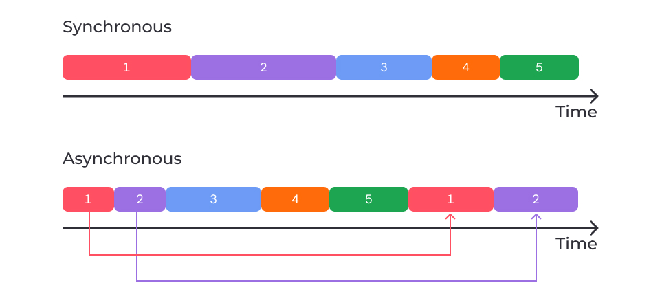
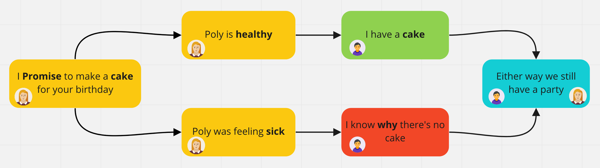
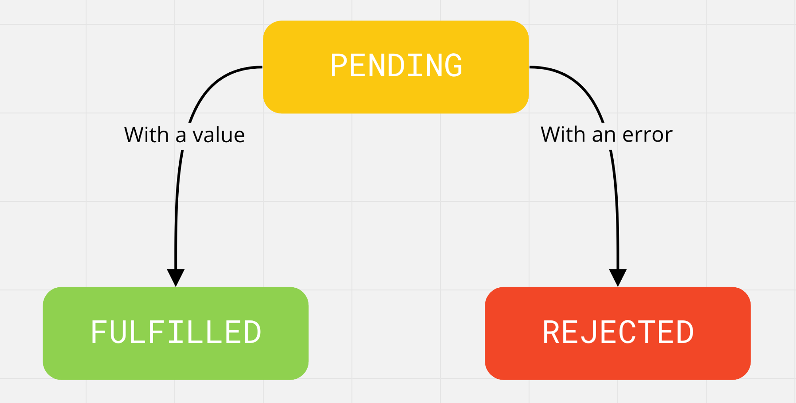
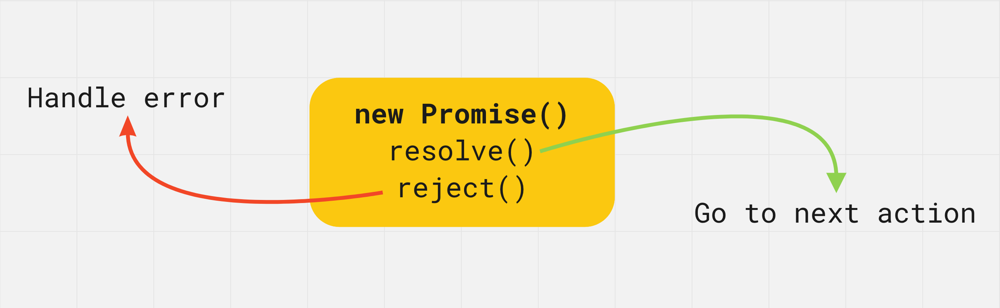

# Асинхронний JavaScript і проміси

###### [to main page](../js_main.md)

---

## Асинхронність

### Асинхронні операції

Весь код виконується процесором твого комп'ютера.

Код, який ми писали досі, був синхронним, тобто займав процесор на весь час
свого виконання. Так, швидкість виконання циклу для ітерації по масиву залежить
від швидкості процесора.

Є операції, які взаємодіють із зовнішнім світом, наприклад: обмін даними із
сервером у мережі. Це набагато повільніше, ніж отримання даних із пам'яті. Якщо
такі операції обробляються синхронно, то процесор простоює під час мережевого
запиту до сервера, замість того, щоб виконувати інший код.

**Синхронний код** виконується послідовно, кожна інструкція очікує, доки
виконається попередня. Коли ти викликаєш функцію, яка виконує тривалу дію, це
зупиняє програму на увесь час її виконання. Тобто в моделі синхронного
програмування все відбувається по черзі.

Уяви чергу придбання квитків на потяг. Ти не можеш почати купувати квиток доти,
доки квиток не придбає людина перед тобою. Так само люди, які стоять за тобою,
не можуть почати купувати квитки доти, доки ти не придбаєш.

В **асинхронному коді** одночасно можуть виконуватися декілька операцій. У такій
моделі мережевий запит на сервер не зупинить програму, вона продовжить
виконувати інші операції. Коли запит завершиться, програма повідомляє про це й
отримує доступ до результату (наприклад, даних із сервера).

Уяви обід в ресторані. Ти та інші відвідувачі замовляєте їжу. Тобі не потрібно
чекати, доки їм принесуть їжу, перш ніж замовляти. Так само інші відвідувачі не
повинні чекати, доки ти отримаєш свою страву і поїси, перш ніж вони зможуть
замовити. Кожен отримає свою страву, щойно її завершать готувати.

Розглянемо різницю на прикладі, у якому програма виконує два мережеві запити на
сервер, після чого обробляє їх результат.

Операції `1` і `2` — це функції, які роблять запити на сервер.

Операції `3`, `4` і `5` — будь-який інший звичний для тебе код.



У **синхронній моделі** все зрозуміло — попередні операції блокують виконання
наступних, доки вони не завершаться. Якщо операції `3`, `4` і `5` — це обробка
кліків користувача, то інтерфейс просто зависне, доки не будуть виконані й
оброблені результати запитів `1` і `2`.

Уявімо, що користувач відправив коментар (мережевий запит) і водночас захотів
відкрити сайдбар з останніми новинами. Після кліка відправити коментар,
інтерфейс зависне і не буде реагувати на його дії, доки від сервера не прийде
результат відправлення коментаря. Погодься, це не дуже зручно.

В **асинхронній моделі** старт мережевого запиту викликає щось на зразок
розгалуження, тобто запуск запиту і результат його обробки — це різні дії. Доки
виконується запит, програма продовжує працювати й виконувати інший код. Щойно
мережевий запит буде виконаний, програма може почати обробляти його результат
одразу після звільнення. Це означає, що користувач відправив коментар і відразу
зміг відкрити сайдбар зі свіжими новинами, не чекаючи, доки прийде відповідь від
сервера.

За одиницю часу, як і раніше, може виконуватися тільки одна операція, тому що
JavaScript — однопотокова мова. Асинхронне програмування досягається шляхом
відкладених викликів функцій, де ініціалізація асинхронної операції і обробка її
результату — це різні дії.

---

## Асинхронний код

У синхронному коді інструкції обробляються послідовно. Отже, наступна інструкція
не може почати своє виконання, доки не виконається попередня.

```js
console.log('First log');
console.log('Second log');
console.log('Third log');
```

У консолі будуть три послідовні повідомлення в тому порядку, в якому відповідні
функції `console.log()` були викликані.

```js
First log
Second log
Third log
```

Код нижче — асинхронний. З функцією `setTimeout()` ми познайомимося далі. Зараз
про неї нам потрібно знати тільки те, що вона приймає два параметри:

-   callback-функцію, яка буде викликана після закінчення часу
-   час, після якого буде викликана функція

```js
// Виконується першою
console.log('First log');

setTimeout(() => {
    // Виконується третьою, через 2000 мілісекунд (2 секунди)
    console.log('Second log');
}, 2000);

// Виконується другою
console.log('Third log');
```

Функція `setTimeout()` відпрацьовує синхронно й реєструє відкладений виклик
переданої callback-функції. Ця функція буде викликана асинхронно, через вказаний
проміжок часу.

Хоча маємо 3 різні команди `console.log()`, їх порядок виводу може бути не
відповідним послідовності коду через асинхронну природу `setTimeout()`.

```js
First log
Third log
Second log
```

Послідовність подій:

1. Виконується синхронний `console.log("First log");`, і в консоль виводиться
   "First log".
2. Виконується `setTimeout()`, який синхронно ставить передану функцію в
   асинхронну чергу на виконання. Але через вказану затримку в 2000 мілісекунд
   (2 секунди), виконання цієї функції відкладається на цей час.
3. Виконується синхронний `console.log("Third log");`, і в консоль виводиться
   "Third log".
4. Після 2 секунд виконується асинхронний виклик функції, переданої в
   `setTimeout()`, і в консоль виводиться "Second log".

---

### Багатопотоковість

Не плутай асинхронність і багатопотоковість (паралелізм) — це різні моделі
програмування. Наведемо просту аналогію, яка все розставить на свої місця. Уяви,
що ти шеф у ресторані, і надходить замовлення на каву і тости.

-   **Синхронний однопотоковий підхід** — ти сам спочатку готуєш каву, потім
    тости і подаєш їх, після чого прибираєшся на кухні.
-   **Асинхронний однопотоковий підхід** — ти починаєш готувати каву і
    встановлюєш таймер, потім починаєш готувати тости і так само встановлюєш
    таймер. Доки кава і тости готуються, ти прибираєш на кухні. Коли таймери
    спрацьовують, ти знімаєш з вогню каву, дістаєш тости і подаєш їх.
-   **Багатопотоковий підхід (паралелізм)** — ти наймаєш двох помічників. Одного
    — для приготування кави, а іншого — для тостів. Тепер у тебе є проблема
    управління помічниками (потоками), щоб вони не конфліктували один з одним на
    кухні під час спільного використання ресурсів.

В асинхронних однопотокових процесах у тебе є графік завдань, в якому деякі
завдання залежать від результату роботи інших. З виконанням кожного завдання
викликається код для обробки його результату.

---

### Тайм-аут

Внутрішній таймер-планувальник браузера дозволяє відкладати виклик функції на
певний період часу. Для цього є тайм-аути та інтервали, вони контролюють, коли і
як часто викликається функція. Таймери реалізовані в браузері, а не вбудовані в
мову, і доступні на глобальному об'єкті `window`.

Метод `setTimeout()` дозволяє запланувати одноразовий виклик функції через
певний час.

```js
const timerId = setTimeout(callback, delay, arg1, arg2, ...);
```

-   `callback` — функція, виклик якої необхідно запланувати
-   `delay` — час у мілісекундах, через який callback-функція буде викликана
    один раз

Додаткові аргументи (`arg1`, `arg2` тощо) не обов’язкові і будуть передані
`callback` функції під час виклику. Результатом виклику `setTimout()` буде
цифровий ідентифікатор створеного таймера, який потім може бути використаним для
його подальшого скасування.

---

### Скасування тайм-ауту

Якщо з якихось причин нам потрібно скасувати відкладений виклик функції,
зареєстрованої тайм-аутом, використовується метод `clearTimeout(id)`.

Метод `clearTimeout(id)` приймає ідентифікатор таймера та “очищає його”, тобто
видаляє реєстрацію відкладеного виклику функції з черги.

```js
const greet = () => {
    console.log('Hello!');
};

const timerId = setTimeout(greet, 3000);

clearTimeout(timerId);
```

---

### Інтервал

Метод `setInterval()` — це простий спосіб повторення коду знову і знову з певним
інтервалом.

Синтаксис і параметри такі самі, як у `setTimeout()`.

```js
const intervalId = setInterval(callback, delay, arg1, arg2, ...);
```

Результатом виклику `setInterval()` буде цифровий ідентифікатор створеного
таймера, який потім може бути використаним для його подальшого скасування.

На відміну від `setTimeout()`, інтервал запускає виконання функції не один раз,
а **регулярно повторює її через вказаний проміжок часу**.

---

### Скасування інтервалу

Якщо з якихось причин нам потрібно скасувати виконання функції, зареєстрованої
інтервалом, використовується метод `clearInterval`.

```js
clearInterval(id);
```

Він приймає ідентифікатор інтервалу та очищає його, тобто видаляє виклики,
зареєстровані переданим інтервалом з асинхронної черги.

```js
const greet = () => {
    console.log('Hello!');
};

const intervalId = setInterval(greet, 3000);

clearInterval(intervalId);
```

---

## Дата і час

### Створення дати

Вбудований клас `Date` безпосередньо спрощує більшу частину роботи з датами. Це
дозволяє відображати моменти у часі як об'єкти і маніпулювати ними за допомогою
заздалегідь визначених методів. Використовуючи можливості класу `Date`, можна
створювати годинник, лічильники, календарі та інші інтерактивні елементи
інтерфейсу.

Екземпляр класу `Date` — це об'єкт, що відображає певний момент часу. Створення
дати без аргументів повертає об'єкт, що зберігає дату і час на момент його
ініціалізації, тобто поточні дату і час.

```js
const date = new Date();

console.log(date);
// "Fri Jun 18 2021 15:01:35 GMT+0300 (Eastern European Summer Time)"
```

У рядковому перетворенні об'єкт повертає результат виклику вбудованого методу
`toString()`, тому у першому лозі ми отримаємо рядок, а не об'єкт.

---

### Встановлення дати

Створюючи екземпляр класу `Date`, можна налаштувати різні формати відображення
даних. Нижче приклад, де до класу `Date` передають рядок, який описує тільки
дату.

```js
const date = new Date('2030-03-16');
console.log(date); // "Sat Mar 16 2030 00:00:00 GMT+0200"
```

Тут до `Date` передали рядок, де дата і час розділяються великою літерою `T`
(time).

```js
const date = new Date('2030-03-16T14:25:00');
console.log(date); // "Sat Mar 16 2030 14:25:00 GMT+0200"
```

Як ти бачиш, формат рядка, переданого до `Date`, дуже гнучкий.

Можна передати тільки рік, рік і місяць, або повну дату, включно з числом і
часом.

```js
console.log(new Date('2030')); // "Tue Jan 01 2030 02:00:00 GMT+0200"
console.log(new Date('2030-03')); // "Fri Mar 01 2030 02:00:00 GMT+0200"
console.log(new Date('2030-03-16')); // "Sat Mar 16 2030 02:00:00 GMT+0200"
console.log(new Date('2030-03-16T14:25:00')); // "Sat Mar 16 2030 14:25:00 GMT+0200"
```

Інший спосіб створення нової дати — це передати сім чисел, які описують рік,
місяць (починається з 0), день, години, хвилини, секунди й мілісекунди.
Обов'язкові тільки перші три.

```js
const date = new Date(2030, 2, 16, 14, 25, 0, 0);
console.log(date); // "Sat Mar 16 2030 14:25:00 GMT+0200 "
```

---

### Unix час

Для комп’ютерів відлік часу рахується в мілісекундах, що минули після опівночі 1
січня 1970 року в часовому поясі UTC (Coordinated Universal Time). Це — Unix
час.

Під час ініціалізації дати одним числом, воно являє собою кількість мілісекунд,
що вже минула з 01.01.1970.

```js
console.log(new Date(0));
// "Thu Jan 01 1970 03:00:00 GMT+0300 (Eastern European Standard Time)"

console.log(new Date(15000));
// "Thu Jan 01 1970 03:00:15 GMT+0300 (Eastern European Standard Time)"
```

Вбудований метод getTime() повертає числове значення цієї дати (`timestamp`) —
кількість мілісекунд, що минула з півночі 1 січня 1970 року.

```js
const date = new Date();
console.log(date.getTime()); // 1624021654154\
```

Це число унікальне й ніколи не повториться, тому що момент часу унікальний і
завжди тільки збільшується.

Зручність цього формату полягає в тому, що можна відображати точні моменти часу
у вигляді одного числа і не турбуватися про дати, рядки й часові пояси. Адже
можна отримати всю необхідну інформацію, коли необхідно.

---

### Метод Date.now()

Ми вже розглядали приклад створення об'єкта часу. У нього є метод `getTime`,
який дозволяє отримати числове представлення моменту часу в кількості
мілісекунд.

```js
const date = new Date();
console.log(date.getTime()); // 1624021654154
```

У разі, коли все, що потрібно, це числове представлення моменту часу, немає
сенсу створювати цілий об'єкт. Можна використовувати метод `Date.now()` — це
швидкий і зручний спосіб отримати поточний час у вигляді мілісекунд

```js
const time = Date.now(); // 1693237207904
```

Основна ідея застосування `Date.now()` полягає у вимірюванні часу, розрахунку
інтервалів тощо.

Якщо ти хочеш виміряти, скільки часу займає виконання деякого коду, можна
зробити так:

```js
const startTime = Date.now();

// Твій код, виконуваний упродовж деякого часу
for (let i = 0; i <= 100; i += 1) {
    console.log(i);
}

const endTime = Date.now();
const elapsedTime = endTime - startTime;

console.log(`Elapsed time: ${elapsedTime} ms`);
```

-   Зберегти час до події
-   Зберегти час після події
-   Порахувати різницю між кінцевим і початковим часом

---

### Геттери і сеттери

Екземпляр класу `Date` має безліч методів для читання та запису значень дати і
часу. Методи повертають або присвоюють рік, місяць, день місяця або тижня,
годину, хвилину, секунду і мілісекунду для кожного екземпляра.

Геттери використовуються для читання всієї дати або окремої складової. Значення,
що повертається, залежить від поточного часового поясу, встановленого на
комп'ютері.

```js
const date = new Date('March 16, 2030 14:25:00');
console.log('Date: ', date); // "Sat Mar 16 2030 14:25:00 GMT+0200"

// Повертає день місяця від 1 до 31
console.log('Day: ', date.getDate()); // 16

// Повертає день тижня від 0 до 6, починається з неділі
console.log('Day of the week: ', date.getDay()); // 6

// Повертає місяць від 0 до 11
console.log('Month: ', date.getMonth()); // 2

// Повертає рік з 4 цифр
console.log('Full year: ', date.getFullYear()); // 2030

// Повертає години
console.log('Hours: ', date.getHours()); // 14

// Повертає хвилини
console.log('Minutes: ', date.getMinutes()); // 25

// Повертає секунди
console.log('Seconds: ', date.getSeconds()); // 0

// Повертає мілісекунди
console.log('Milliseconds: ', date.getMilliseconds()); // 0
```

Все, що можна прочитати — можна записати, методи для запису починаються з
префікса `set`.

```js
const date = new Date('March 16, 2030 14:25:00');

date.setMinutes(50);
console.log(date); // "Sat Mar 16 2030 14:50:00 GMT+0200"

date.setFullYear(2040);
console.log(date); // "Fri Mar 16 2040 14:50:00 GMT+0200"

date.setMonth(4);
console.log(date); // "Wed May 16 2040 14:50:00 GMT+0300"
```

---

## Проміси

### Що таке проміси?

Уяви, що Полі **обіцяє** спекти торт на мій день народження через два тижні.

-   Якщо все буде добре і вона не захворіє, у мене буде торт.
-   Якщо Полі буде погано себе почувати, то не зможе спекти торт. У будь-якому
    разі, ми все одно влаштуємо вечірку.

Обіцянка — це не гарантія виконання, ми не знаємо, чи виконає Полі її, чи ні.



У програмуванні також є завдання, результат яких ми дізнаємося тільки в
майбутньому.

**Promise** (проміс, від англ. promise — обіцяти) — об'єкт, що представляє
поточний стан асинхронної операції. Це обгортка для значення, невідомого на
момент створення промісу. Проміс дозволяє обробляти результати асинхронних
операцій таким чином, якби вони були синхронними: замість кінцевого результату
асинхронної операції, повертається своєрідна обіцянка отримати результат у
майбутньому.

### Життєвий цикл проміса

Проміс може бути у трьох станах:

-   **Очікування (pending)** — початковий стан під час створення промісу.
-   **Виконано (fulfilled)** — операція виконана успішно з будь-яким
    результатом.
-   **Відхилено (rejected)** — операція відхилена з помилкою.



На момент створення проміс знаходиться в очікуванні (`pending`). Після чого він
може завершитися успішно (`fulfilled`), повернувши результат (значення). Проміс
може також завершитися не успішно (`rejected`) і повернути помилку. Коли проміс
переходить у стан `fulfilled` або `rejected` — це назавжди.

Коли проміс виконаний або відхилений, використовується термін settled. Це не
окремий стан, а лише спосіб описати, що проміс перебуває в будь-якому стані,
крім очікування.

### Створення проміса

Проміс створюється як екземпляр класу `Promise`, який приймає функцію як
аргумент (називається "виконавцем" (executor)) і відразу викликає її, ще до
створення і повернення промісу.

```js
const promise = new Promise((resolve, reject) => {
    // Asynchronous operation
});
```

-   `resolve(value)` — функція для виклику у разі успішної операції. Переданий
    їй аргумент буде значенням виконаного промісу.
-   `reject(error)` — функція для виклику у разі помилки. Переданий їй аргумент
    буде значенням відхиленого промісу.

Колбек-функція повідомляє проміс, коли і як операція, з якою він пов'язаний,
буде завершена. У ній можна виконувати будь-яку асинхронну операцію. Після її
завершення потрібно викликати:

-   `resolve()` для позначення успішного виконання. Результатом буде
    `fulfilled`.

Або

-   `reject()` у разі помилки, який встановлює стан промісу як "відхилений"
    (`rejected`).

Значення, що повертається цією функцією-виконавцем, ігнорується.



У прикладі показано, як змінюється значення змінної `isSuccess` на true або
`false`, щоб викликати `resolve` або `reject` та імітувати успішне виконання
промісу (`fulfilled`) або виконання з помилкою (`rejected`).

```js
const isSuccess = true;

const promise = new Promise((resolve, reject) => {
    setTimeout(() => {
        if (isSuccess) {
            resolve('Success! Value passed to resolve function');
        } else {
            reject('Error! Error passed to reject function');
        }
    }, 2000);
});

console.log(promise); // Об'єкт промісу
```

У змінну `promise` буде записаний проміс (об'єкт) у стані `pending`, а через дві
секунди, щойно буде викликаний `resolve()` або `reject()`, проміс перейде у стан
`fulfilled` або `rejected`, і ми зможемо його обробити.
