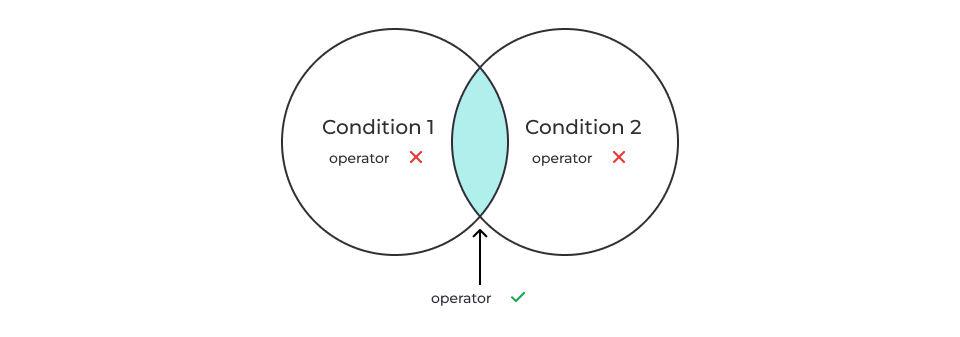
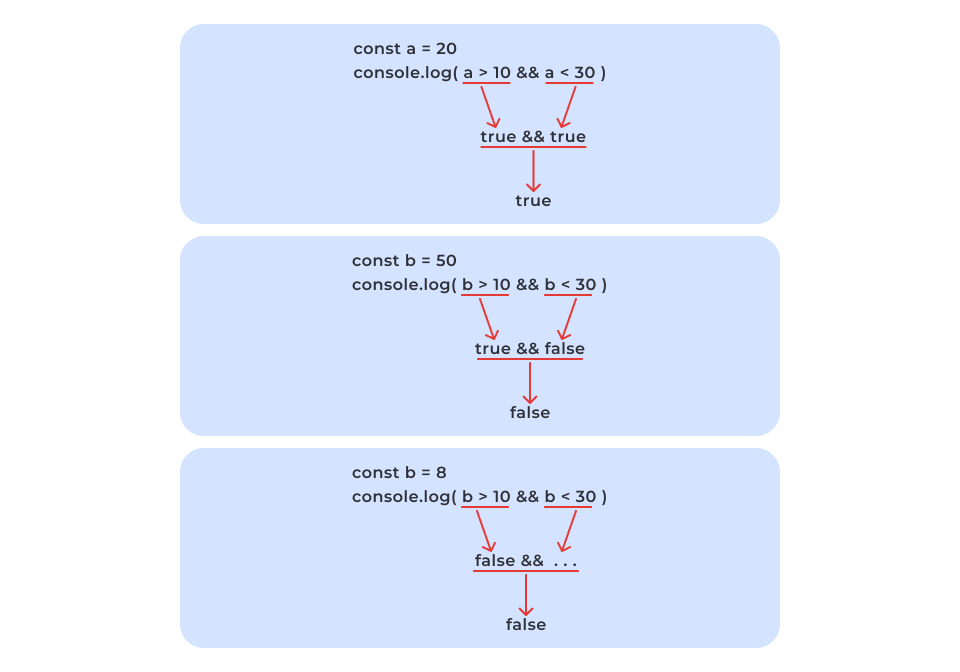

# Розгалуження і цикли

###### [to main page](../js_main.md)

---

## Розгалуження

Уяви онлайн-сервіс, що дозволяє завантажувати книги з бібліотеки.

Відвідувачі можуть користуватися сервісом безкоштовно (з обмеженням швидкості
завантажень). Якщо людина бажає завантажувати книги без обмежень, вона повинна
купити підписку “pro” за 100$ на рік.

Це простий приклад розгалуження, у якому наявність підписки “pro” — це умова, а
різні варіанти завантажень (з обмеженням чи без) — це розгалуження подальших
сценаріїв.

Розгалуження використовуються для виконання різного коду залежно від умови.

---

## Інструкція `if`

Інструкція `if` дозволяє виконати певний блок коду **тільки** в тому випадку,
**якщо** задана **умова істинна** (тобто приймає значення **true**).

Загальний синтаксис інструкції **`if`** виглядає так:

```js
if (condition) {
    // код, який виконується, якщо умова (condition) істинна
}
```

Коли інтерпретатор зустрічає інструкцію `if`, він **обчислює вказану умову в
круглих дужках (condition)**, перетворюючи її до логічного типу (boolean).

Якщо умова (condition) перетворюється до `true`, **виконується блок коду,
написаний у фігурних дужках {} — (statement)**.

Якщо умова (condition) перетворюється до `false`, блок коду не виконається і
продовжиться виконання програми, що іде після інструкції `if`.


У наведених нижче прикладах код перевіряє значення змінної `subscription` і
залежно від нього встановлює значення змінної `price`.

Якщо умова перетворюється до `true`, тобто `subscription` — це `"pro"`, `price`
встановлюється `100`.

```js
let price = 0;
const subscription = 'pro';

if (subscription === 'pro') {
    price = 100;
}

console.log(price); // 100
```

Якщо умова перетворюється до `false`, код у фігурних дужках не буде виконуватися
і `price` залишиться рівним `0`.

```js
let price = 0;
const subscription = 'free';

if (subscription === 'pro') {
    price = 100;
}

console.log(price); // 0
```

---

## Логічні оператори

### Перетворення типів: логічне

Логічне перетворення типів означає приведення значення будь-якого типу даних у
логічне (булеве) значення `true` або `false`. Існує кілька правил, які
визначають, які значення перетворюються на `true`, а які на `false`.

Ці правила працюють:

-   як для **явного** перетворення типів за допомогою функції `Boolean()`,
-   так і для **неявного** в умовних операціях, наприклад, у конструкціях if чи
    логічних операторах.

#### Логічні значення

Логічні значення `true` та `false` залишаються незмінними.

```js
console.log(Boolean(true)); // true
console.log(Boolean(false)); // false
```

#### Числа

Число `0`, значення `NaN`, `null` і `undefined` завжди перетворюються на
`false`. Усі інші числа перетворюються на `true`.

```js
console.log(Boolean(NaN)); // false
console.log(Boolean(null)); // false
console.log(Boolean(undefined)); // false
console.log(Boolean(0)); // false
console.log(Boolean(3.14)); // true
console.log(Boolean(-10)); // true
```

Розгляньмо ці приклади. Який блок коду буде виконуватися?

```js
if (null) {
    console.log('Block if');
} else {
    console.log('Block else');
}

if (0) {
    console.log('Block if');
} else {
    console.log('Block else');
}
```

Значення в умові інструкцій `if` приводиться до `false` . Отже, виконується код
із блоку `else`.

А в цьому прикладі який код виконується?

```js
if (5) {
    console.log('Block if');
} else {
    console.log('Block else');
}
```

Значення в умові інструкції `if` приводиться до `true` . Отже, виконується код
із блоку `if`.

#### Рядки

Порожній рядок (`""`) приводиться до `false`. Будь-які інші не пусті рядки
приводяться до true.

```js
console.log(Boolean('')); // false
console.log(Boolean('hello')); // true
console.log(Boolean('false')); // true
```

Прочитай приклад нижче. Код із якого блоку буде виконано?

```js
if ('') {
    console.log('Block if');
} else {
    console.log('Block else');
}
```

У прикладі в умові інструкції `if` вказаний порожній рядок. Порожній рядок
приводиться до `false`. Отже, виконується код із блоку else.

А в цьому прикладі? Який саме блок коду буде виконано?

```js
if ('batman') {
    console.log('Block if');
} else {
    console.log('Block else');
}
```

В умові інструкції — рядок `"batman"`.

Отже, `if` наводиться до `true`. Виконується код із блоку `if`.

> ! Запам’ятай _6 випадків_, які _приводяться до false_:

1. `0`
2. `""`
3. `Nan`
4. `null`
5. `underfined`
6. `false`

---

## Логічне «І»

Логічні оператори використовуються для перевірки умов з кількома виразами,
наприклад, в інструкції `if`.

Оператор "І" (`&&`) наводить усі операнди до логічного типу (`true` або `false`)
і повертає значення одного з них. Дозволяє перевірити, чи виконані _всі умови_ у
виразі.



Обчислення оператора відбувається зліва направо.

```js
expression1 && expression2;
```

Оператор “І” зліва направо перевіряє почергово обидва операнди на істинність та
повертає або значення останнього істинного (тільки правого) операнда, або
першого хибного (лівого чи правого), на якому він запнувся.

Давай розглянемо це на простому прикладі. Уяви: якщо людина п’є каву з цукром і
молоком, то її не влаштує кава хоча б без одного з цих компонентів. Усі
компоненти є обов’язковими, інакше людина її пити не буде.

У наступних прикладах обидва операнди перетворюються на `true`. Обчислення
відбуваються зліва направо, тому результатом буде значення правого операнда.

```js
console.log('hello' && 5); // 5
console.log(5 && 'hello'); // "hello"

console.log('mango' && 'poly'); // "poly"
console.log('poly' && 'mango'); // "mango"

console.log(3 && true); // true
console.log(true && 3); // 3
```

А ось у цьому прикладі один із операндів буде приведений до `false`, отже,
результатом буде хибний операнд.

```js
console.log('hello' && 0); // 0
console.log(0 && 'hello'); // 0

console.log(3 && false); // false
console.log(false && 3); // false

console.log(0 && ''); // 0
console.log('' && 0); // ""
```

-   У прикладі `“hello” && 0` лівий операнд приводиться до `true`, а правий до
    `false`, тому результатом виразу буде значення правого операнда, який першим
    був приведений до false, тобто `0`.
-   У приклад `0 && “hello”` лівий операнд приводиться до `false`, тому правий
    операнд не буде обчислюватися. Результатом виразу буде значення лівого
    операнда, який першим був приведений до false, тобто `0`.

На практиці логічні операції застосовуються для перевірки множинних умов.

Варто зазначити, що якщо операндами є вирази, то спочатку вони обчислюються, а
потім їх результати будуть порівнюватися оператором `&&.`

```js
const a = 20;
console.log(a > 10 && a < 30); // true && true -> true

const b = 50;
console.log(b > 10 && b < 30); // true && false -> false
console.log(b > 80 && b < 120); // false && true -> false
```

У прикладі вище змінна `a` має одночасно задовольняти дві умови: бути 1) більшою
за 10, але 2) меншою за 30. Перевірку одночасного виконання двох умов ми робимо
за допомогою оператора `&&.` Спочатку обчислюємо вирази в операндах.



Оператор `&&` може бути не тільки самостійною умовою, а й частиною більш
складних умов, наприклад, в умові інструкції `if`

```js
const screenWidth = 700;
const sm = 320;
const md = 768;
const lg = 1200;

if (screenWidth <= sm) {
    console.log('Mobile screen');
} else if (screenWidth > sm && screenWidth <= md) {
    console.log('Tablet screen');
} else if (screenWidth > md && screenWidth <= lg) {
    console.log('Desktop screen');
} else {
    console.log('Godzilla screen');
}
```

Приклад вище має ланцюжок перевірок, розглянемо їх.

Спочатку перевіряється умова `if`, тобто `700 < 320`, вона повертає `false`,
тому тіло блоку `if` ігнорується і виконання коду переходить далі до блоку
`else...if`. У ньому є умова `screenWidth > sm && screenWidth ≤ md`.

Спочатку обчислиться лівий операнд, умова `700 > 320` , яка поверне `true` ,
потім правий — `700 <= 768` , який теж поверне `true`.

Оскільки обидва операнди істинні, то `true && true` поверне значення крайнього
істинного операнда, тобто `true` . Завдяки тому, що в умові інструкції
`else...if` буде true, виконається її тіло і в консоль виведеться рядок
`“Tablet screen”`
